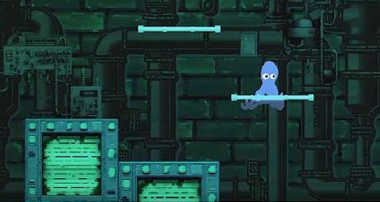

# Octo's Outbreak 🐙  
 A fluid 2D platformer featuring an octopus escaping a laboratory, powered by procedural animation and custom environmental interactions.  

**Play Now**: [WebGL Demo](https://madisonj5.itch.io/octosoutbreak)  

---

## About the Game  
You are Octo, a nimble cephalopod determined to escape an underground research facility. Navigate treacherous labs using:  
- **8-Legged Movement System**: Crawl, leap, climb walls, and swing through gaps  
- **Environmental Manipulation**: Pick up/throw objects with `P` key  
- **Dynamic Motion**: Transition seamlessly between jumping and mid-air swinging  

---

## Technical Implementation 🔧  
**Engine**: Unity 2021.3 (WebGL build)  
**Key Features**:  
- **Procedural Tentacle Animation**  
  Leg movements adapt to:  
  - Surface contact points  
  - Momentum direction  
  - Environmental collisions  
- **Custom Shaders**  
  - Proximity-based bubble effects  
  - Dynamic ambient lighting  
- **Physics-Driven Movement**  
  Hybrid system combining:  
  - Rigidbody dynamics  
  - Custom velocity constraints  
  - Collider-based limb anchoring  

---

## Controls 🎮  
| Action                | Key                 |  
|-----------------------|---------------------|  
| Movement              | `WASD`/`Arrow Keys` |  
| Jump/Swing Initiate   | `SPACE`             |  
| Interact with Objects | `P`                 |  

---

## Development Team 👥  
- **Programming & Design**: Jupiter Westbard, Jake Kerrigan, Michael Hu, Madison Johnson, Matthew Johnson  
- **Original Art**: Custom created assets by development team
- **Music**: Soundtrack composed by Owen Haber

---

## Building From Source  
1. Clone repository  
2. Open in Unity 2021.3+  
3. Build & Run (WebGL target recommended)  

---

\
Distributed under [MIT License](LICENSE). All original assets included under same terms.  